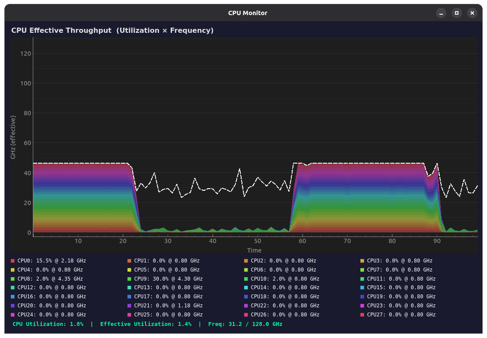

# CPU Monitor



A real-time CPU monitoring desktop application built with PyQt6 and pyqtgraph. It displays a stacked area chart of **effective CPU throughput** (utilization × frequency) for every logical core, along with per-core stats and system totals.

 

## Features

- **Stacked area chart** — each logical core is a distinct color band showing its effective GHz contribution over time.
- **Total frequency line** — white dashed line overlaying the chart shows aggregate clock speed.
- **Per-core legend** — live utilization percentage and current frequency for every core, reflowed into columns to fit the window width.
- **System totals** — overall CPU utilization, effective utilization, and aggregate frequency vs. maximum.
- **Dark theme** — comfortable for extended monitoring sessions.
- **Extensible panel architecture** — subclass `BasePanel` to add new monitoring panels (temperature, fan speed, etc.).
- **Learned Y-axis scaling** — the chart automatically learns your CPU's real-world max frequency over time. Once it has observed a full window of samples, it saves a high water mark to `~/.local/share/cpu_monitor/` and uses it on every subsequent launch so the Y-axis is correctly scaled from the first tick.

## Requirements

- Python 3.10+
- Linux (reads per-core frequencies from `/sys/devices/system/cpu/`)

## Installation

```bash
git clone <repo-url>
cd cpu_usage
pip install -r requirements.txt
```

## Usage

```bash
python cpu_util.py
```

The window opens at 1100×700 and updates every 500 ms by default. Tunable constants live in [helpers.py](helpers.py):

| Constant   | Default | Description                        |
|------------|---------|------------------------------------|
| `HISTORY`  | 100     | Number of samples visible on chart |
| `INTERVAL` | 500     | Milliseconds between updates       |

### Teaching the Y-axis scaling

The effective throughput chart scales its Y-axis to the highest aggregate CPU frequency it has observed. On a fresh install it learns this value over time, but you can teach it immediately by maxing out all cores for a short burst:

```bash
# Install stress if needed
sudo apt install stress      # Debian/Ubuntu
sudo dnf install stress      # Fedora/RHEL

# Run with the app open — 30 seconds is enough to fill the sample window
stress -c $(nproc) -t 30
```

After the stress run completes the learned maximum is saved to `~/.local/share/cpu_monitor/learned_max_freq.json` and will be used on every future launch.

## Project Structure

```
cpu_util.py   — Application entry point and main window
helpers.py    — Configuration constants and system data collection
panels.py     — BasePanel class and CpuThroughputPanel implementation
```

## License

MIT